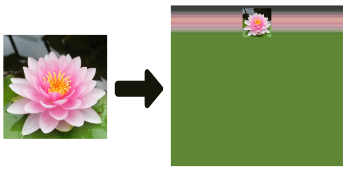

# Image Background Generator
When you want to make an image bigger but keeping its size, you can put the image on a bigger one. But how do you want to make the bigger image?
One way is to colorize it with a plain color. In this way, it wouldn't go with your image, would it?
Or you can use this code to simply make a better background for your image.
# Demo

# Tutorial
<video width="320" height="240" controls>
  <source src="./assets/image_background_generator.mp4" type="video/mp4">
</video>